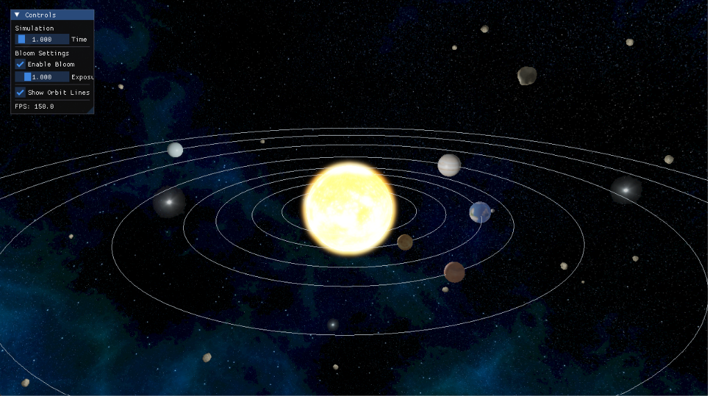

# Solar System with HDR Bloom (OpenGL C++)

An OpenGL 3D project that simulates the Solar System with a strong focus on **HDR rendering and bloom effects**.  

### Solar System Overview


---

### Core Rendering
- Full 3D rendering of:
  - Sun
  - 8 planets
  - Earth’s Moon
- Realistic textures for all planets
- Full cubemap skybox filled with stars (texture available here https://opengameart.org/)

## Basic Features

### Lights
- Phong lighting
- diffuse
- specular
- ambient
- emissive Sun
- HDR exposure

### Textures
- texture for sun and each planet
- moon
- night map Earth
- cubemap skybox

### Multiple Models
- multiple sphere instances
- different textures
- rendering asteroids (.obj)

### Cubemap
- real cubemap skybox
- 6 textures

### Game Logic
- orbits system
- hierarchy Earth/Moon
- time control
- UI runtime
- toggle for bloom and orbits

### Object Moving
- orbits
- rotations
- camera

### Free Navigation
- FPS camera
- mouse look
- WASD system
- zoom

### Reflection
- skybox texture reflect on Earth

## Intermediate Features

### Frame Buffer Object effect
- HDR framebuffer
- ping pong blur
- bloom pipeline

---

## Controls

- WASD --> Move camera
- Mouse --> Look around
- Scroll --> Zoom
- TAB --> Toggle mouse/UI mode
- ESC --> Exit

---

## Project Tree Folder
```
SolarSystem/
│
├── include/
│   ├── glad/
│   ├── GLFW/
│   ├── glm/
│   ├── KHR/
│   ├── tinyobjectloader/
│        ├── tiny_obj_loader.h
|   ├── utils/
|        ├── texture.h
|        ├── cubemap.h
│   └── stb_image.h
│
│
├── resources/
│   ├── textures/
│       ├── skybox/
│   ├── models/
│       ├── asteroid/
│   └── hdr/                
│
├── shaders/
│   ├── scene.vert
│   ├── scene.frag
│   ├── blur.vert           
│   ├── blur.frag
|   ├── orbit.frag
|   ├── orbit.vert           
│   ├── bloom_final.vert    
│   └── bloom_final.frag
│   ├── quad.vert    
│   └── quad.frag
│   ├── skybox.vert    
│   └── skybox.frag
│
├── src/
│   ├── main.cpp
│   ├── glad.c
│
│   ├── core/               
│   │   ├── shader.h / shader.cpp
│   │   ├── camera.h / camera.cpp
│   │   ├── framebuffer.h / framebuffer.cpp
│
│   ├── rendering/          
│   │   ├── sphere.h / sphere.cpp
│   │   ├── render.h / render.cpp
│   │   ├── orbit.h / orbit.cpp
│   │   ├── planet.h / planet.cpp
│
│   ├── utils/              
│   │   ├── texture.cpp
│   │   ├── cubemap.cpp
|
│   ├── external/
│   │   ├── imgui
|
├── .gitignore   
├── CMakeLists.txt          
└── README.md
```

---

## Dependencies

The project uses the following libraries:

- **GLFW** -> windowing and input  
- **GLAD** -> OpenGL loader  
- **GLM** -> mathematics (vectors, matrices)  
- **stb_image** -> texture loading
- **imgui** -> ImGuI rendering
  
---

## Requirements

- Visual Studio 2022 or compatible C++17 compiler (e.g. `g++`, `clang`, MSVC)
- CMake ≥ 3.10
- OpenGL 3.3+

---

## Clone the Repository

```bash
git clone https://github.com/NiccoBene00/OpenGL-SolarSystemSceneRendering.git
cd SolarSystem
```

---

## Building Instruction

Create build directory under the root folder
```bash
mkdir build
cd build
```

Generate project files
```bash
cmake ..
```

Compile
```bash
cmake --build .
```

After the build process completes, the executable will be generated inside the build (or for instance in bulild/Debug/ if you use Visual Studio Community 2022) directory.
```bash
./SolarSystem.exe
```

---

## Notes

*Rendering quality and visual appearance may vary depending on GPU drivers, OpenGL implementation, monitor settings, and hardware acceleration support.*

