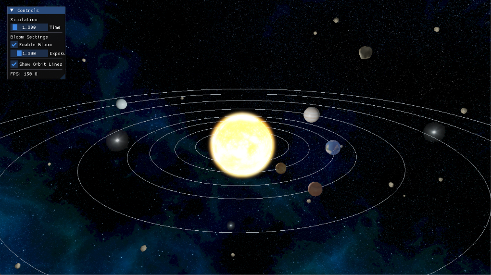
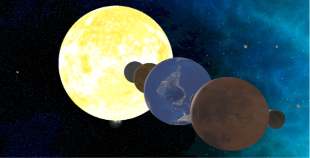
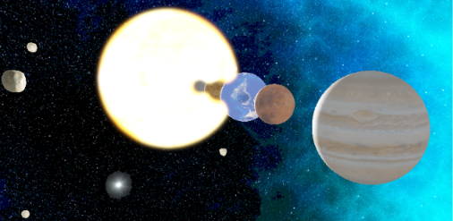
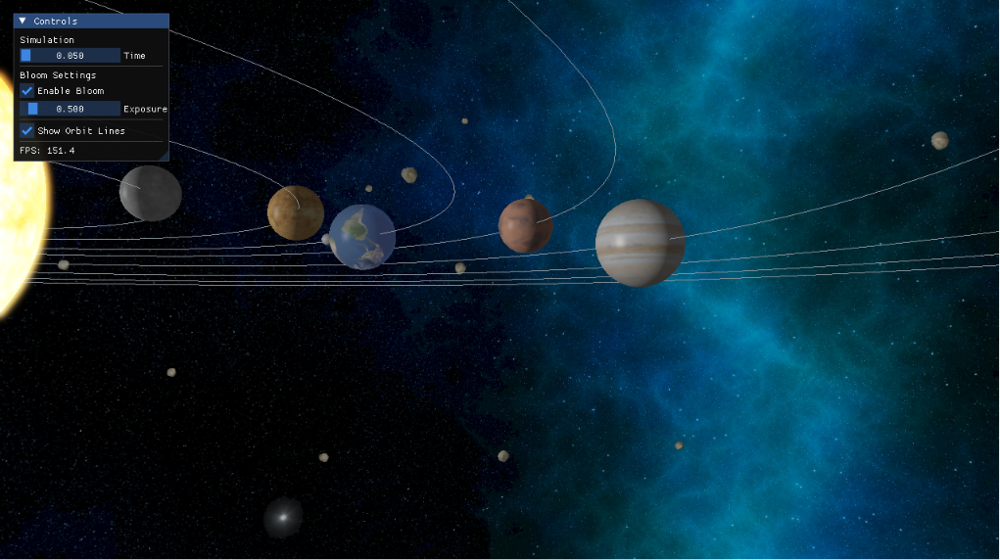
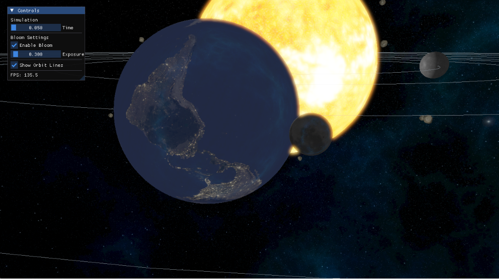
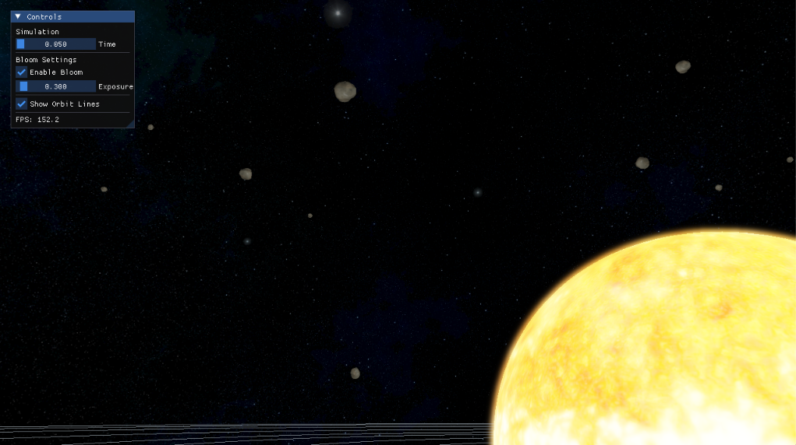
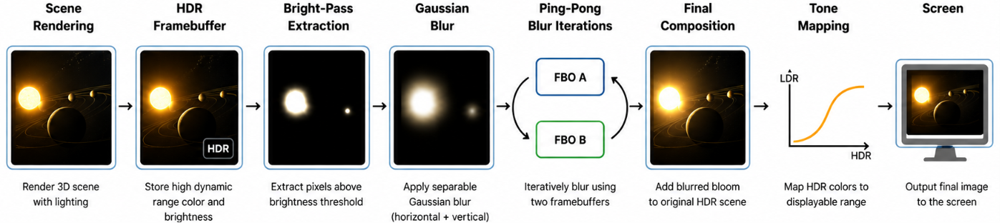

# Real-Time Solar System with HDR Bloom (OpenGL 3.3, C++)

A real-time 3D simulation of the Solar System built from scratch with **OpenGL 3.3 Core Profile**. The main technical focus is a complete **HDR rendering and bloom post-processing pipeline** (multi-render-target framebuffer, bright-pass extraction, separable Gaussian blur with ping-pong framebuffers, tone mapping), on top of a scene with textured planets, an asteroid field, a cubemap skybox, environment-mapped reflections and a free-flying camera.

> **Context.** 3D Graphics course project, Polytech, Université Libre de Bruxelles (June 2026). Authors: Niccolò Benedetto and Paolo Alberto Bordis. Instructors: Prof. Daniele Bonatto and Eline Soetens.
> 

<p align="center"></p>

## Highlights

- **HDR bloom pipeline** with a 16-bit floating-point framebuffer (`GL_RGBA16F`) and two color attachments written in a single pass (scene + bright fragments).
- **Separable Gaussian blur** with two ping-pong framebuffers, reducing the cost of the kernel from O(N²) to O(2N) per pixel.
- **Tone mapping** with an adjustable exposure, controlled at runtime.
- **Full scene:** Sun (emissive), 8 planets, Earth's Moon, orbit lines, `.obj` asteroid field, Earth night-lights texture.
- **Phong lighting** with a visible day/night side on every planet.
- **Cubemap skybox** and **environment-mapped reflections** on Earth.
- **Free camera** (FPS style) and a **Dear ImGui** control panel (bloom toggle, exposure, time scale, orbit visibility).

## Results

| Without bloom | With bloom |
|:---:|:---:|
|  |  |

| Day and night side | Earth night lights | Asteroid field |
|:---:|:---:|:---:|
|  |  |  |

## How the bloom pipeline works

Real light sources never look perfectly sharp: bright regions bleed into neighboring pixels. Bloom reproduces this glow as an image-space post-processing effect. It is perceptually plausible rather than physically accurate.

<p align="center"></p>

1. **HDR framebuffer.** A standard framebuffer clamps colors to [0, 1], so a bright Sun looks the same as a white surface. The scene is rendered into a `GL_RGBA16F` framebuffer, which allows values above 1.0.
2. **Bright-pass extraction.** The scene shader writes to two color attachments at once: attachment 0 holds the normal scene, attachment 1 holds only the fragments whose luminance exceeds a threshold, with
   `brightness = 0.2126 R + 0.7152 G + 0.0722 B`.
3. **Gaussian blur.** The Gaussian kernel is separable, so the blur is applied as a horizontal pass followed by a vertical pass, alternating between two framebuffers (ping-pong). Doing this several times widens the glow.
4. **Composition.** The blurred image is added to the original HDR scene: `C_final = C_original + C_bloom`.
5. **Tone mapping.** HDR values are mapped back to the displayable range with `C_LDR = 1 − exp(−C_HDR · exposure)`.

## Other rendering features

| Feature | Implementation |
|---|---|
| Lighting | Phong model (ambient + diffuse with Lambert's cosine law + specular). The Sun is a purely emissive object. |
| Skybox | Cubemap with six textures. Camera translation is removed from the view matrix (`mat4(mat3(view))`), so the background always looks infinitely far away. |
| Reflections | Environment mapping on Earth: reflection vector `R = I − 2(N·I)N`, used to sample the skybox cubemap. |
| External models | Asteroids loaded from `.obj` files with TinyObjLoader and uploaded to the GPU through VBO and VAO. |
| Camera | FPS camera with mouse look, WASD movement and zoom. The view matrix is recomputed every frame. |
| Runtime UI | Dear ImGui panel connected to C++ variables: bloom on/off, exposure, simulation speed, orbit lines. |
| Scene logic | Orbits and rotations for every body, with the Moon in an Earth-relative hierarchy. |

## Controls

| Input | Action |
|---|---|
| `W` `A` `S` `D` | Move the camera |
| Mouse | Look around |
| Scroll | Zoom |
| `TAB` | Switch between mouse-look and UI mode |
| `ESC` | Exit |

## Tech stack

- **Language / API:** C++17, OpenGL 3.3 Core Profile, GLSL
- **Libraries:** GLFW (window and input), GLAD (function loader), GLM (math), Dear ImGui (UI), stb_image (textures), TinyObjLoader (`.obj` models)
- **Build system:** CMake (3.10 or newer)

## Build and run

Requirements: a C++17 compiler (MSVC from Visual Studio 2022, `g++` or `clang`), CMake 3.10+, and a GPU with OpenGL 3.3 support.

```bash
git clone https://github.com/NiccoBene00/OpenGL-SolarSystemSceneRendering.git
cd OpenGL-SolarSystemSceneRendering

mkdir build
cd build
cmake ..
cmake --build .
```

Run the executable from the build directory (for example `build/Debug/` with Visual Studio):

```bash
./SolarSystem.exe
```

## Project structure

```
├── src/
│   ├── main.cpp
│   ├── core/        shader, camera, framebuffer
│   ├── rendering/   model, render, orbit, planet
│   └── utils/       texture and cubemap loading
├── shaders/         scene, bloom blur, bloom final composition, skybox, orbit, quad
├── resources/       textures, skybox faces, asteroid model
├── include/         third-party headers (GLAD, GLFW, GLM, TinyObjLoader, stb_image)
├── external/imgui   Dear ImGui
├── screenshots/
├── docs/            presentation slides and figures
└── CMakeLists.txt
```

## Documentation

- [Project presentation (16 slides)](docs/HDR_Bloom_Solar_System_slides.pdf)

## Possible improvements

- Blinn-Phong or physically based shading instead of classic Phong.
- Downsampled blur passes to make a wider glow cheaper.
- Real-scale distances and sizes, shadows and eclipses.

## References

- T. Akenine-Möller, E. Haines, N. Hoffman, A. Pesce, M. Iwanicki, S. Hillaire. *Real-Time Rendering, Fourth Edition*. CRC Press, 2021.
- M. Ashikhmin, P. Shirley. *An anisotropic Phong light reflection model*. Technical Report UUCS-00-014, University of Utah, 2000.

## Credits and licenses

Rendering and application code: Niccolò Benedetto and Paolo Alberto Bordis. Third-party libraries keep their own licenses. The star skybox comes from [OpenGameArt](https://opengameart.org/).
<!-- TODO: add the source and license of the planet textures and of the asteroid model, and add a LICENSE file (for example MIT for your own code). -->

*Rendering quality and visual appearance may vary depending on GPU drivers, OpenGL implementation and monitor settings.*

